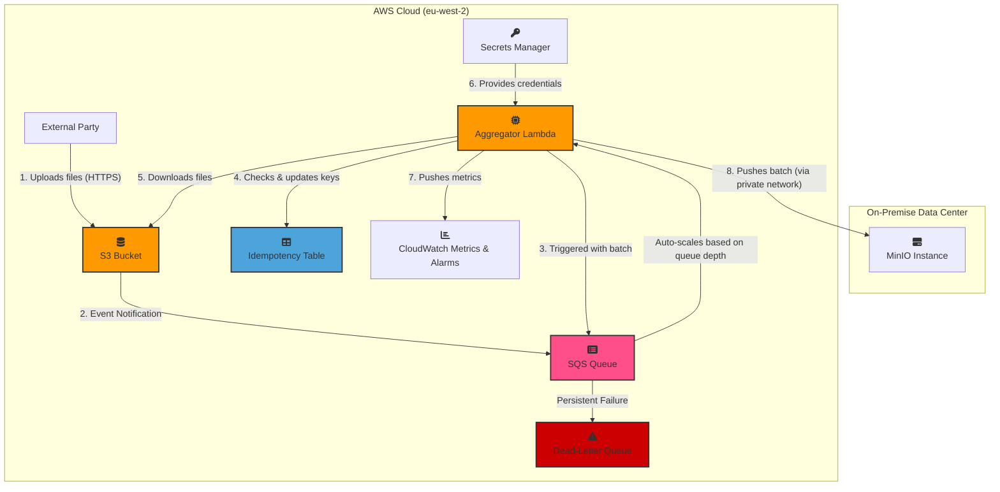

### Updated Document (v4.0)

# Project: Real-Time Data Ingestion and Aggregation Pipeline

**Document Version:** 4.0
**Date:** July 2, 2025
**Author(s):** `john51246`

## 1\. Executive Summary

This document outlines the requirements and technical design for a new data pipeline. The primary goal is to reliably ingest a high volume of small data files from an external third party, process them in near real-time, and securely deliver aggregated, compressed data batches to an on-premise MinIO storage instance.

The projected data volume is **\~864,000 objects per day**, assuming an average rate of 10 files/second. The proposed solution leverages a modern, serverless, event-driven architecture on AWS, designed to be **resilient**, **scalable**, and **cost-effective**. The entire infrastructure will be defined as code (IaC) using Terraform for automated, repeatable, and auditable management.

**Primary Success Metric:** ≥ 99.9% of incoming files will be successfully processed and delivered to the on-premise MinIO instance **within 3 minutes** of their arrival in the S3 landing zone under normal operating conditions.

-----

## 2\. Business & Functional Requirements

| ID         | Requirement          | Details                                                                                                                                                                          |
|:-----------|:---------------------|:---------------------------------------------------------------------------------------------------------------------------------------------------------------------------------|
| **REQ-01** | **Data Ingestion**   | The system must provide a secure S3 bucket as a landing zone for an external party to upload data files.                                                                         |
| **REQ-02** | **Data Aggregation** | **The system must collect incoming data files and process them in near real-time batches. An archive is created from all unique files processed in a single Lambda invocation.** |
| **REQ-03** | **Data Compression** | The aggregated data batch must be compressed (Gzip) to reduce its size for efficient storage and transfer.                                                                       |
| **REQ-04** | **Secure Delivery**  | The final compressed data batch must be securely delivered to the on-premise MinIO storage instance.                                                                             |
| **REQ-05** | **Data Integrity**   | The system should perform checksum validation on data batches before and after transfer to ensure no data corruption has occurred.                                               |

-----

## 3\. Non-Functional Requirements

| ID         | Category                   | Requirement & Rationale                                                                                                                                                                                                                                 |
|:-----------|:---------------------------|:--------------------------------------------------------------------------------------------------------------------------------------------------------------------------------------------------------------------------------------------------------|
| **NFR-01** | **Availability**           | The ingestion endpoint (S3) must achieve **≥ 99.99% availability**. The end-to-end pipeline should be resilient to transient failures of individual components.                                                                                         |
| **NFR-02** | **Latency (SLO)**          | **95%** of files should be delivered to MinIO within **2 minutes** of arrival. **99.9%** should be delivered within **3 minutes**.                                                                                                                      |
| **NFR-03** | **Durability / Retention** | Raw files in the S3 landing zone will be retained in a hot, accessible tier for **7 days** for immediate audit/replay. After 7 days, they will be automatically transitioned to **S3 Glacier Deep Archive** for long-term, low-cost archival.           |
| **NFR-04** | **Resilience & Backlog**   | In the event of an outage of the on-premise endpoint, the system must buffer incoming data without loss. The SQS queue will be configured with a **4-day message retention** period. Alerts will trigger if the backlog exceeds 1 hour's worth of data. |
| **NFR-05** | **Scalability**            | The system must handle the baseline load of **10 files/sec** and be able to automatically scale to handle bursts of up to **100 files/sec** without performance degradation.                                                                            |
| **NFR-06** | **Security**               | Communication must be encrypted-in-transit (TLS 1.2+) at all stages. Data must be encrypted-at-rest in S3 and SQS. Access credentials for MinIO will be managed by AWS Secrets Manager with a defined rotation policy.                                  |
| **NFR-07** | **Observability**          | The system must provide key health metrics, including queue depth, processing errors, and processing latency. Critical failures (e.g., failed batches, connectivity loss) must trigger automated alerts.                                                |

-----

## 4\. Proposed Architecture (v4.0 - As-Built Design)

### 4.1. High-Level Design

The architecture is a fully decoupled, event-driven pipeline optimized for scalability and resilience. The design uses a direct **SQS Event Source Mapping** for the Lambda function. This is the standard AWS best practice and allows the Lambda service to **automatically scale concurrency** based on queue depth, directly fulfilling the scalability requirement (`NFR-05`).

The introduction of DynamoDB for idempotency management prevents duplicate processing, and a Dead-Letter Queue (DLQ) captures any terminally failing messages for manual inspection.

### 4.2. Architectural Diagram

### 4.3. Design Considerations & Risk Mitigation

  * **Idempotency & State Management:** To prevent duplicate processing, the Lambda uses a **DynamoDB** table with a Time-to-Live (TTL) attribute to track processed file keys. Before processing, a `PutItem` call with a `ConditionExpression="attribute_not_exists(ObjectID)"` ensures atomicity.
  * **Data Integrity (REQ-05):** The system guarantees end-to-end data integrity. The Lambda computes the SHA256 checksum of the archive, uploads it, attaches the checksum as metadata, and then performs a final `HEAD` request to verify the checksum in MinIO matches the original.
  * **Lambda Execution:** The processing logic is written in **Python**.
      * **Memory/Temp Storage:** **The risk of memory exhaustion is mitigated by using a `SpooledTemporaryFile`. The archive is built in an efficient in-memory buffer. If the archive's size exceeds a configured threshold (e.g., 256MB), it transparently spills to the Lambda's ephemeral `/tmp` disk storage. This handles large batches while remaining highly performant for smaller, more common ones.**
      * **Timeout:** The SQS visibility timeout will be set to **6x the average Lambda execution time** to provide a robust buffer for retries on transient failures.
  * **Secrets Management:** Credentials for MinIO are retrieved from AWS Secrets Manager. The Lambda caches these credentials in-memory for 5 minutes to improve performance.

-----

## 5\. Implementation & Operations Plan

| Phase              | Activity                         | Key Deliverables / Actions                                                                                                                                                                                                                                                                            |
|:-------------------|:---------------------------------|:------------------------------------------------------------------------------------------------------------------------------------------------------------------------------------------------------------------------------------------------------------------------------------------------------|
| **1. Infra Setup** | Core Infrastructure Provisioning | Terraform modules for core components (VPC, IAM roles) and application components (S3, SQS, **DynamoDB**, Lambda). The Lambda trigger will be an `aws_lambda_event_source_mapping` resource.                                                                                                          |
| **2. Dev & Test**  | Lambda Logic & Unit Testing      | Develop idempotent **Python** code for the Lambda. The code is structured into testable modules (`core.py`, `clients.py`). A comprehensive `pytest` suite using `moto` mocks AWS services to validate correctness and prevent regressions.                                                            |
| **3. Integration** | End-to-End & Load Testing        | Deploy to a staging environment. Conduct load tests simulating baseline (10 files/sec) and burst loads (100 files/sec). **Crucially, test the outage scenario** by blocking connectivity to a mock endpoint and verifying that SQS buffers correctly and the system recovers.                         |
| **4. Deployment**  | Production Rollout               | Use a blue/green deployment strategy for the Lambda function (via aliases and traffic shifting) to enable zero-downtime updates and instant rollbacks.                                                                                                                                                |
| **5. Operations**  | Monitoring & Alerting            | Configure CloudWatch Alarms for: 1) SQS queue depth (`ApproximateNumberOfMessages` \> threshold), 2) `ApproximateAgeOfOldestMessage` \> 1 hour, 3) High Lambda error/throttle rates, 4) Messages in the DLQ. The Lambda will also emit custom metrics for `FilesProcessed` and `ProcessingLatencyMs`. |

-----

## 6\. High-Level Cost Estimate

*This is a preliminary estimate and will be refined. Assumes `eu-west-2` region.*

| Service          | Dimension                                        | Estimated Monthly Cost | Notes                                                                                                                                                                             |
|:-----------------|:-------------------------------------------------|:-----------------------|:----------------------------------------------------------------------------------------------------------------------------------------------------------------------------------|
| S3               | 26M PUTs, 165 GB-Mo (Hot), 2TB-Mo (Deep Archive) | \~$145                 | Assumes 100KB/file avg, 7-day hot tier.                                                                                                                                           |
| SQS              | 26M Requests                                     | \~$10                  | Standard Queue pricing.                                                                                                                                                           |
| Lambda           | \~2.6M invocations, 1.2M GB-seconds              | \~$25                  | **Based on \~2.6M monthly invocations (assuming an SQS batch size of 10) and 1024MB memory. The majority of the cost is from execution duration, not the number of invocations.** |
| DynamoDB         | On-Demand Capacity, low usage                    | \~$5                   | For idempotency tracking. Minimal cost.                                                                                                                                           |
| Data Transfer    | \~650 GB Egress to On-Prem                       | \~$60                  | Cost depends on final network solution (TBD).                                                                                                                                     |
| **Total (Est.)** |                                                  | **\~$245 / month**     | *Excludes fixed costs of the private network solution.*                                                                                                                           |