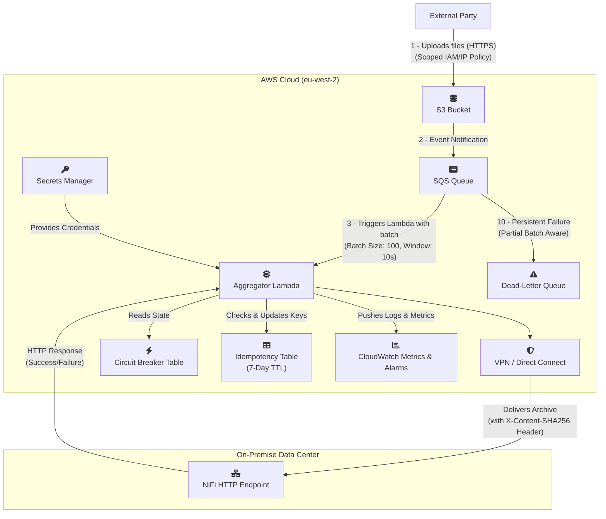

### **Project: Real-Time Data Ingestion and Aggregation Pipeline**

**Document Version: 6.4**
**Date:** July 5, 2025
**Author(s):** john51246, Senior Design Peer

#### **1. Executive Summary**

This document outlines the requirements and technical design for a new data pipeline. The primary goal is to reliably ingest a high volume of small data files from an external third party, process them in near real-time, and securely deliver aggregated, compressed data batches to an on-premise Apache NiFi instance. The design prioritizes resilience, security, and operational excellence.

The projected data volume is ~864,000 objects per day (avg. 10 files/sec). The solution leverages a modern, serverless, event-driven architecture on AWS. Key features include a configurable Circuit Breaker pattern for robust fault tolerance against downstream failures, end-to-end data integrity validation using cryptographic hashes, and a comprehensive testing strategy to ensure reliability under load. The entire infrastructure will be defined as code (IaC) for automated and auditable management, with security controls embedded throughout the design.

**Primary Success Metric:** ≥ 99.9% of incoming files will be successfully processed and delivered to the on-premise NiFi endpoint within 3 minutes of their arrival in the S3 landing zone under normal operating conditions.

#### **2. Business & Functional Requirements**

| ID     | Requirement      | Details                                                                                                                                                                               |
|:-------|:-----------------|:--------------------------------------------------------------------------------------------------------------------------------------------------------------------------------------|
| REQ-01 | Data Ingestion   | The system must provide a secure S3 bucket as a landing zone for an external party to pur data files into. Each file will be unique.                                                  |
| REQ-02 | Data Aggregation | The system must collect incoming data files and process them in batches of less than 15 seconds. An archive is created from all unique files processed in a single Lambda invocation. |
| REQ-03 | Data Compression | The aggregated data batch must be compressed (Gzip) to reduce its size for efficient storage and transfer.                                                                            |
| REQ-04 | Secure Delivery  | The final compressed data batch must be securely delivered to the on-premise NiFi ingest endpoint via an HTTP POST request.                                                           |

#### **3. Non-Functional Requirements**

| ID     | Category                     | Requirement & Rationale                                                                                                                                                                                                                                                                                                                                                                           |
|:-------|:-----------------------------|:--------------------------------------------------------------------------------------------------------------------------------------------------------------------------------------------------------------------------------------------------------------------------------------------------------------------------------------------------------------------------------------------------|
| NFR-01 | Availability                 | The ingestion endpoint (S3) must achieve ≥ 99.99% availability. The end-to-end pipeline should be resilient to transient failures of individual components.                                                                                                                                                                                                                                       |
| NFR-02 | Latency (SLO)                | 95% of files should be delivered to the on-premise endpoint within 2 minutes of arrival. 99.9% should be delivered within 3 minutes.                                                                                                                                                                                                                                                              |
| NFR-03 | Durability / Retention       | Raw files in the S3 landing zone will be retained for 7 days for immediate audit/replay. After 7 days, they will be transitioned to S3 Glacier Deep Archive. **This retention strategy is accepted. The business acknowledges the 9-12 hour restore time for Deep Archive is acceptable for archival purposes.**                                                                                  |
| NFR-04 | Resilience & Backlog         | In the event of an outage of the on-premise endpoint, the system must buffer incoming data without loss. The SQS queue will be configured with a 4-day message retention period. **The 4-day backlog capacity is approved for business continuity.** Alerts will trigger if the backlog exceeds 1 hour's worth of data. An operational runbook will define the response procedure for this alert. |
| NFR-05 | Scalability                  | The system must handle the baseline load of 10 files/sec and be able to automatically scale to handle bursts of up to 100 files/sec without performance degradation. **Note:** Default Lambda concurrency limits will be monitored during load testing to ensure they are not a bottleneck.                                                                                                       |
| NFR-06 | Security                     | Communication must be encrypted-in-transit (TLS 1.2+) at all stages. Data must be encrypted-at-rest in S3 and SQS. Access credentials for the NiFi endpoint will be managed by AWS Secrets Manager with a defined rotation policy. IAM roles will adhere to the principle of least privilege.                                                                                                     |
| NFR-07 | Observability                | The system must provide key health metrics, including queue depth, processing errors, and processing latency. Critical failures (e.g., failed batches, connectivity loss) must trigger automated alerts.                                                                                                                                                                                          |
| NFR-08 | Resilience / Fault Tolerance | The system must gracefully handle prolonged outages of the on-premise NiFi endpoint. It must detect when the endpoint is unavailable and "fail-fast" to prevent excessive retries, cost, and load on the failing system. It must automatically resume processing once the endpoint becomes available again.                                                                                       |
| NFR-09 | Data Integrity               | End-to-end data integrity must be guaranteed. The system will compute a cryptographic hash of the data payload before delivery. The receiving endpoint must validate this hash to protect against data corruption during transit.                                                                                                                                                                 |
| NFR-10 | Network Security             | Connectivity between AWS and the on-premise data center must be established over a secure, private channel. The solution will be either an AWS Site-to-Site VPN or AWS Direct Connect, not the public internet.                                                                                                                                                                                   |

#### **4. Proposed Architecture (v6.4 - As-Built Design)**

##### **4.1. High-Level Design**

The architecture is a fully decoupled, event-driven pipeline. The design uses a direct SQS Event Source Mapping for the Lambda function, allowing for automatic scaling based on queue depth and robust buffering.

To enhance resilience and security, the design incorporates:
*   **Idempotency Management:** A DynamoDB table with a 7-day TTL tracks processed file keys to prevent duplicates, enforcing a "first-in wins" policy. This is critical given the source is an S3 sync, which may retry uploads and generate duplicate events.
*   **Circuit Breaker:** A second DynamoDB table implements a configurable circuit breaker to gracefully handle downstream NiFi endpoint failures.
*   **Data Integrity:** A SHA-256 hash of the payload is sent as an HTTP header with every request.
*   **Partial Batch Failure Handling:** The Lambda is designed to process messages individually within a batch, ensuring a single bad message does not halt processing for the entire batch.

##### **4.2. Architectural Diagram**

---

### **5. Security Architecture & CIA Analysis**

This section details the security controls embedded in the design, analyzed against the Confidentiality, Integrity, and Availability (CIA) triad.

#### **5.1. Confidentiality (Preventing unauthorized disclosure)**

| Control                           | Implementation Detail                                                                                                                                                                                                                                                                                                                 |
|:----------------------------------|:--------------------------------------------------------------------------------------------------------------------------------------------------------------------------------------------------------------------------------------------------------------------------------------------------------------------------------------|
| **Encryption-in-Transit**         | All communication channels use TLS 1.2 or higher. This includes the third-party upload to S3, internal AWS service communication, and the final delivery to the on-premise NiFi endpoint via the private network connection.                                                                                                          |
| **Encryption-at-Rest**            | All data stored in AWS is encrypted at rest. This includes objects in the S3 landing zone (SSE-S3), messages in the SQS queue and DLQ (SSE-SQS), and items in the DynamoDB tables (SSE-DynamoDB), using AWS-managed keys.                                                                                                             |
| **Secrets Management**            | Credentials for the on-premise NiFi endpoint (e.g., API keys, tokens) will be stored securely in AWS Secrets Manager. The Lambda function's IAM role will have specific, limited permissions to retrieve this secret at runtime. A secret rotation policy will be defined.                                                            |
| **Least Privilege IAM Roles**     | All components (e.g., the Lambda function) operate under IAM roles with the minimum necessary permissions. The Lambda role cannot, for example, delete S3 objects or modify its own configuration.                                                                                                                                    |
| **Restricted Third-Party Access** | The IAM principal provided to the external party will be restricted by an **`aws:SourceIp` condition**, ensuring that upload credentials can only be used from their known, trusted IP address ranges.                                                                                                                                |
| **Secure VPC Egress**             | The Lambda function will be deployed into a private subnet within a VPC. Its associated Security Group will enforce a **default deny on all egress traffic**, with explicit allow rules only for: 1) the on-premise NiFi IP/port, and 2) **VPC Endpoints** for S3, SQS, and DynamoDB, keeping all AWS traffic on the private network. |
| **Sanitized Application Logging** | The Lambda's application code will be developed to **explicitly prevent logging of sensitive data**. Only metadata (e.g., S3 object keys, timestamps, error types) will be logged to CloudWatch, never the raw file content or PII extracted from it.                                                                                 |

#### **5.2. Integrity (Protecting against unauthorized modification)**

| Control                                    | Implementation Detail                                                                                                                                                                                                                                                                                                                                                              |
|:-------------------------------------------|:-----------------------------------------------------------------------------------------------------------------------------------------------------------------------------------------------------------------------------------------------------------------------------------------------------------------------------------------------------------------------------------|
| **End-to-End Data Hashing**                | The Lambda function will compute a SHA-256 hash of the final Gzip archive before delivery. This hash is sent in the `X-Content-SHA256` HTTP header. The on-premise NiFi endpoint is required to recalculate the hash on the received payload and reject the delivery if the hashes do not match, protecting against data corruption in transit.                                    |
| **S3 Object Versioning & Locking**         | The S3 landing bucket will have **Object Versioning enabled**. This prevents accidental data loss, as a `DELETE` operation will create a delete marker rather than permanently removing the data, allowing for recovery.                                                                                                                                                           |
| **Hardened S3 Bucket Policy**              | The IAM policy for the external party will grant `s3:PutObject` but will **explicitly deny `s3:GetObject`, `s3:ListBucket`, and `s3:DeleteObject`**. This ensures the third party can only write new data and cannot read, list, or modify existing data in the bucket.                                                                                                            |
| **Infrastructure-as-Code (IaC) Integrity** | The entire infrastructure is defined in Terraform. The source code repository will be secured with: 1) **Branch protection rules** requiring PRs and status checks for the `main` branch. 2) **Mandatory peer reviews** for all infrastructure changes. 3) **Automated static code analysis** (e.g., `tfsec`) in the CI/CD pipeline to detect misconfigurations before deployment. |

#### **5.3. Availability (Ensuring the system is operational)**

| Control                                          | Implementation Detail                                                                                                                                                                                                                                                                                                                                                                                                                   |
|:-------------------------------------------------|:----------------------------------------------------------------------------------------------------------------------------------------------------------------------------------------------------------------------------------------------------------------------------------------------------------------------------------------------------------------------------------------------------------------------------------------|
| **Decoupled, Buffered Ingestion**                | SQS decouples the ingestion point (S3) from the processing logic (Lambda). It provides a durable buffer for incoming messages, configured with a **4-day retention period**, ensuring data is not lost if the processing tier is unavailable.                                                                                                                                                                                           |
| **Downstream Fault Tolerance (Circuit Breaker)** | A custom Circuit Breaker (using DynamoDB) is implemented in the Lambda. It will automatically detect a failing on-premise endpoint, "trip open" to stop sending requests, and prevent cascading failures and excessive costs. It will periodically test the connection and automatically resume processing when the endpoint recovers. **State changes are atomic (using Conditional Updates) and it correctly handles HTTP timeouts.** |
| **Scalability & Burst Handling**                 | The serverless architecture (S3, SQS, Lambda) scales automatically with demand. The system is designed to handle the baseline 10 files/sec and burst up to 100 files/sec without manual intervention.                                                                                                                                                                                                                                   |
| **Partial Batch Failure Handling**               | The system uses SQS's partial batch failure reporting. If one message in a batch of 100 fails processing, only that single message is returned to the queue for a retry. The other 99 are processed successfully, maximizing throughput even during partial failures.                                                                                                                                                                   |
| **Denial-of-Wallet Protection**                  | In addition to AWS Budgets, **CloudWatch Anomaly Detection** will be configured on the SQS `NumberOfMessagesSent` metric. This will provide an early warning for unusual traffic spikes (e.g., from a misconfigured sync tool or malicious actor) that could lead to unexpected high costs.                                                                                                                                             |
| **Dead-Letter Queue (DLQ) for Failures**         | Messages that consistently fail processing (e.g., poison pills) are automatically moved to a Dead-Letter Queue after a configured number of retries. This prevents a single bad message from blocking the entire pipeline. An operational runbook and alerting are in place for the DLQ.                                                                                                                                                |

---

#### **6. Implementation & Operations Plan**

| Phase          | Activity                         | Key Deliverables / Actions                                                                                                                                                                                                                                |
|:---------------|:---------------------------------|:----------------------------------------------------------------------------------------------------------------------------------------------------------------------------------------------------------------------------------------------------------|
| 1. Infra Setup | Core Infrastructure Provisioning | Terraform modules incorporating all security controls: S3 versioning & policies, IAM roles with `SourceIp` conditions, VPC with private subnets and VPC Endpoints, restrictive Security Groups, and all service configurations.                           |
| 2. Dev & Test  | Lambda Logic & Unit Testing      | Develop idempotent, secure Python code for the Lambda, including SHA-256 hashing, partial batch failure logic, and **sanitized logging**. A `pytest` suite will use `moto` to mock AWS services and `requests-mock` to simulate the NiFi endpoint.        |
| 3. Integration | E2E & Fault Tolerance Testing    | Deploy to a staging environment. Conduct comprehensive testing as defined in Section 8, including all security and fault tolerance scenarios.                                                                                                             |
| 4. Deployment  | Production Rollout               | Use a blue/green deployment strategy for the Lambda function (via aliases and traffic shifting) to enable zero-downtime updates and instant rollbacks. The IaC pipeline will include **mandatory security scans** (`tfsec`) before deployment.            |
| 5. Operations  | Monitoring & Alerting            | Configure CloudWatch Alarms for queue depth, Lambda errors, DLQ messages, and the Circuit Breaker state. Implement the **Composite Alarm** for high-severity outages and the **Anomaly Detection** alarm for traffic spikes. Define an AWS Budgets alarm. |
| 6. Ops         | DLQ Management                   | A documented runbook and associated script/Lambda will be created for analyzing and replaying messages from the DLQ, ensuring no data is lost due to transient code bugs.                                                                                 |

---

#### **7. High-Level Cost Estimate**
This is a preliminary estimate and will be refined. Assumes `eu-west-2` (London) region pricing.

| Service                    | Dimension                                        | Estimated Monthly Cost    | Notes                                                                                                                                                         |
|:---------------------------|:-------------------------------------------------|:--------------------------|:--------------------------------------------------------------------------------------------------------------------------------------------------------------|
| S3                         | 26M PUTs, 165 GB-Mo (Hot), 2TB-Mo (Deep Archive) | ~£116                     | Assumes 100KB/file avg, 7-day hot tier. Versioning adds a small storage overhead.                                                                             |
| SQS                        | 26M Requests                                     | ~£8                       | Standard Queue pricing.                                                                                                                                       |
| Lambda                     | ~263k invocations, 1.2M GB-seconds               | ~£3                       | Based on ~263k monthly invocations (batch size 100). Cost optimized by using **Graviton2 (arm64) architecture**.                                              |
| DynamoDB (Idempotency)     | On-Demand Capacity, low usage w/ TTL             | ~£4                       | For idempotency tracking.                                                                                                                                     |
| DynamoDB (Circuit Breaker) | On-Demand Capacity, very low usage               | ~£1                       | For circuit breaker state.                                                                                                                                    |
| CloudWatch                 | Metrics, Logs, Alarms                            | ~£12                      | Includes standard logging, custom metrics, and Anomaly Detection alarm cost.                                                                                  |
| Network Solution           | VPN or Direct Connect                            | ~£160 - £800+             | Significant variable. Includes VPC Endpoint costs (minor) and VPN/Direct Connect (major).                                                                     |
| Data Transfer              | ~650 GB Egress over private network              | ~£24                      | Data transfer over private network is cheaper than public internet.                                                                                           |
| **Total (Est.)**           |                                                  | **~£328 - £968+ / month** | **Highlights the efficiency of the serverless design, with the primary operational cost being the fixed network connection rather than the data processing.** |

*Note: Costs are estimated in GBP, assuming an approximate conversion rate of $1.00 = £0.80. Actual costs will vary with usage, contract pricing, and prevailing exchange rates.*

---

#### **8. Testing Strategy**

##### **8.1. Guiding Principles**
*   **Test for Failure:** Actively simulate and test failure scenarios, not just the happy path.
*   **Automate Everything:** All tests should be scriptable and runnable in a CI/CD pipeline.
*   **Test in Production-like Environments:** The staging environment must be a 1:1 replica of production.

##### **8.2. Unit Testing**
*   **Scope:** Testing individual Python functions in isolation.
*   **Tools:** `pytest`, `moto` (to mock AWS services), `requests-mock` (to simulate NiFi).
*   **Key Scenarios:**
    *   Successful processing of a batch of S3 event messages.
    *   Correct generation of the `X-Content-SHA256` header.
    *   Idempotency logic correctly identifying and skipping a previously processed file.
    *   Partial Batch Failure: Correctly identifies and returns specific `messageId`s for failed items within a batch, allowing SQS to redrive only those messages.

##### **8.3. Integration Testing**
*   **Scope:** Verifying the interactions between the deployed AWS services.
*   **Tools:** Terraform deployment to a test environment, AWS CLI/SDK scripts.
*   **Key Scenarios:**
    *   An `s3:ObjectCreated:*` event correctly creates a message in the SQS queue.
    *   The Lambda's IAM role permissions are correctly enforced (e.g., cannot write to S3).
    *   The `BatchSize` (100) and `MaximumBatchingWindowInSeconds` (10) settings are correctly applied to the SQS event source mapping.
    *   TTL configuration on the idempotency DynamoDB table correctly removes old items.
    *   Terraform variables for the circuit breaker are correctly read by the Lambda function.

##### **8.4. End-to-End (E2E) & Fault Tolerance Testing**
*   **Scope:** Testing the entire pipeline from file upload to NiFi delivery, focusing on resilience.
*   **Tools:** Staging environment, custom load generation scripts, network ACLs/firewall rules to simulate outages.
*   **Key Scenarios:**
    *   **Circuit Breaker Test:** Validate open/half-open/closed state transitions under simulated network failure.
    *   **Partial Batch Failure Test:** Verify that a single failed file in a batch does not stop the others.
    *   **DLQ & Poison Pill Test:** Test both malformed messages and structurally valid messages that cause unhandled code exceptions to ensure they are correctly moved to the DLQ after retries.
    *   **Security Control Test:** As part of integration testing, explicitly verify that the Lambda's IAM role prevents forbidden actions (e.g., attempting to delete an S3 object) and that its Security Group blocks egress to the public internet.

##### **8.5. Load & Performance Testing**
*   **Scope:** Validating the system meets scalability (NFR-05) and latency (NFR-02) requirements.
*   **Tools:** Load testing framework (e.g., Locust, Artillery), AWS Lambda Power Tuning tool.
*   **Key Scenarios:**
    *   **Baseline Load:** Run a sustained test at 10 files/sec and measure end-to-end latency against the 3-minute SLO.
    *   **Burst Load:** Simulate a spike to 100 files/sec and verify the system scales automatically without errors and that latency remains within acceptable bounds.
    *   **Soak Test:** Run the baseline load for an extended period (e.g., 8+ hours) to check for memory leaks or performance degradation.
    *   **Cost Optimization:** Run the Lambda Power Tuning state machine under a realistic load profile to determine the most cost-effective memory configuration.