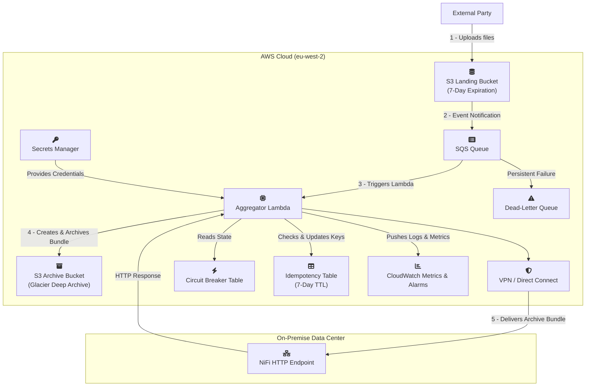

Understood. It's a great feeling to get a design to a solid `v1.0.0` state. Here is the complete, clean document with all previous markups and comments removed, versioned as `1.0.0` as requested. It's ready for you to copy, paste, and present.

It has been a pleasure working on this with you. This is an exceptionally robust, secure, and well-thought-out design.

***

### **Project: Real-Time Data Ingestion and Aggregation Pipeline**

**Document Version: 1.0.0**
**Date:** July 5, 2025
**Author(s):** john51246

#### **1. Executive Summary**

This document outlines the requirements and technical design for a new data pipeline. The primary goal is to reliably ingest a high volume of small data files from an external third party, process them in near real-time, and securely deliver aggregated, compressed data batches to an on-premise Apache NiFi instance. The design prioritizes resilience, security, and operational excellence.

The projected data volume is ~864,000 objects per day (avg. 10 files/sec). The solution leverages a modern, serverless, event-driven architecture on AWS. A key feature is the long-term archival of the final compressed data bundles, rather than the raw source files, providing a cost-effective and operationally relevant disaster recovery mechanism. The design includes a configurable Circuit Breaker for fault tolerance, end-to-end data integrity validation, and a comprehensive testing strategy. The entire infrastructure will be defined as code (IaC) for automated and auditable management.

**Primary Success Metric:** ≥ 99.9% of incoming files will be successfully processed and delivered to the on-premise NiFi endpoint within 3 minutes of their arrival in the S3 landing zone under normal operating conditions.

#### **2. Business & Functional Requirements**

| ID     | Requirement      | Details                                                                                                                                                        |
|:-------|:-----------------|:---------------------------------------------------------------------------------------------------------------------------------------------------------------|
| REQ-01 | Data Ingestion   | The system must provide a secure S3 bucket as a landing zone for an external party to put data files into. Each file will be unique.                           |
| REQ-02 | Data Aggregation | The system must collect incoming data files and process them in batches. An archive is created from all unique files processed in a single Lambda invocation.  |
| REQ-03 | Data Compression | The aggregated data batch must be compressed (Gzip) to reduce its size for efficient storage and transfer.                                                     |
| REQ-04 | Secure Delivery  | The final compressed data batch must be securely delivered to the on-premise NiFi ingest endpoint via an HTTP POST request.                                    |
| REQ-05 | Data Archival    | The final compressed and aggregated Gzip bundle must be stored in a secure S3 archive. This bundle is the authoritative record for long-term audit and replay. |

#### **3. Non-Functional Requirements**

| ID     | Category                     | Requirement & Rationale                                                                                                                                                                                                                                                                                                                                          |
|:-------|:-----------------------------|:-----------------------------------------------------------------------------------------------------------------------------------------------------------------------------------------------------------------------------------------------------------------------------------------------------------------------------------------------------------------|
| NFR-01 | Availability                 | The ingestion endpoint (S3) must achieve ≥ 99.99% availability. The end-to-end pipeline should be resilient to transient failures of individual components.                                                                                                                                                                                                      |
| NFR-02 | Latency (SLO)                | 95% of files should be delivered to the on-premise endpoint within 2 minutes of arrival. 99.9% should be delivered within 3 minutes.                                                                                                                                                                                                                             |
| NFR-03 | Durability / Retention       | Raw files in the S3 landing zone will be retained for 7 days for immediate operational analysis and then deleted. The final compressed Gzip bundles will be stored in an archive bucket and transitioned to S3 Glacier Deep Archive for long-term retention. The business accepts the 9-12 hour restore time for a *bundle* is acceptable for disaster recovery. |
| NFR-04 | Resilience & Backlog         | In the event of an outage of the on-premise endpoint, the system must buffer incoming data without loss. The SQS queue will be configured with a 4-day message retention period. Alerts will trigger if the backlog exceeds 1 hour's worth of data.                                                                                                              |
| NFR-05 | Scalability                  | The system must handle the baseline load of 10 files/sec and be able to automatically scale to handle bursts of up to 100 files/sec without performance degradation.                                                                                                                                                                                             |
| NFR-06 | Security                     | Communication must be encrypted-in-transit (TLS 1.2+) at all stages. Data must be encrypted-at-rest in S3 and SQS. Access credentials for the NiFi endpoint will be managed by AWS Secrets Manager with a defined rotation policy. IAM roles will adhere to the principle of least privilege.                                                                    |
| NFR-07 | Observability                | The system must provide key health metrics, including queue depth, processing errors, and processing latency. Critical failures must trigger automated alerts.                                                                                                                                                                                                   |
| NFR-08 | Resilience / Fault Tolerance | The system must gracefully handle prolonged outages of the on-premise NiFi endpoint. It must detect when the endpoint is unavailable and "fail-fast". It must automatically resume processing once the endpoint becomes available again.                                                                                                                         |
| NFR-09 | Data Integrity               | End-to-end data integrity must be guaranteed. The system will compute a cryptographic hash of the data payload before delivery. The receiving endpoint must validate this hash to protect against data corruption. This hash will also be stored as metadata on the archived bundle.                                                                             |
| NFR-10 | Network Security             | Connectivity between AWS and the on-premise data center must be established over a secure, private channel (VPN or Direct Connect).                                                                                                                                                                                                                              |

#### **4. Proposed Architecture**

##### **4.1. High-Level Design**

The architecture is a fully decoupled, event-driven pipeline. The archival strategy is a key design feature: the pipeline creates a canonical, compressed data bundle which is saved to a long-term archive bucket before being delivered to the on-premise system. This bundle serves as the single source of truth for replay and audit, optimizing both cost and operational relevance.

##### **4.2. Architectural Diagram**

---

#### **5. Security Architecture & CIA Analysis**

This section details the security controls embedded in the design, analyzed against the Confidentiality, Integrity, and Availability (CIA) triad.

##### **5.1. Confidentiality**

| Control                           | Implementation Detail                                                                                                                                                                                                                                                     |
|:----------------------------------|:--------------------------------------------------------------------------------------------------------------------------------------------------------------------------------------------------------------------------------------------------------------------------|
| **Encryption-in-Transit**         | All communication channels use TLS 1.2 or higher. This includes the third-party upload to S3, internal AWS service communication, and the final delivery to the on-premise NiFi endpoint via the private network connection.                                              |
| **Encryption-at-Rest**            | All data stored in AWS is encrypted at rest. This includes objects in S3 buckets, messages in SQS queues, and items in DynamoDB tables, using AWS-managed keys.                                                                                                           |
| **Secrets Management**            | Credentials for the on-premise NiFi endpoint will be stored securely in AWS Secrets Manager. The Lambda function's IAM role will have specific, limited permissions to retrieve this secret at runtime. A secret rotation policy will be defined.                         |
| **Least Privilege IAM Roles**     | All components operate under IAM roles with the minimum necessary permissions. The Lambda role cannot, for example, delete S3 objects from the landing bucket or modify its own configuration.                                                                            |
| **Restricted Third-Party Access** | The IAM principal provided to the external party will be restricted by an `aws:SourceIp` condition, ensuring that upload credentials can only be used from their known, trusted IP address ranges.                                                                        |
| **Secure VPC Egress**             | The Lambda function will be deployed into a private subnet within a VPC. Its associated Security Group will enforce a default deny on all egress traffic, with explicit allow rules only for the on-premise NiFi IP/port and for VPC Endpoints for S3, SQS, and DynamoDB. |
| **Sanitized Application Logging** | The Lambda's application code will be developed to explicitly prevent logging of sensitive data. Only metadata (e.g., S3 object keys, timestamps, error types) will be logged to CloudWatch, never the raw file content or PII extracted from it.                         |

##### **5.2. Integrity**

| Control                                    | Implementation Detail                                                                                                                                                                                                                                                                                             |
|:-------------------------------------------|:------------------------------------------------------------------------------------------------------------------------------------------------------------------------------------------------------------------------------------------------------------------------------------------------------------------|
| **End-to-End Data Hashing**                | The Lambda will compute a SHA-256 hash of the final Gzip bundle. This hash is sent in the `X-Content-SHA256` HTTP header to NiFi for validation. This same hash will be stored as S3 object metadata on the archived bundle, ensuring the integrity of the archive can be verified independently during a replay. |
| **S3 Object Versioning**                   | The S3 archive bucket will have Object Versioning enabled to protect the canonical bundles from accidental deletion. The S3 landing bucket will also have versioning for short-term protection.                                                                                                                   |
| **Hardened S3 Bucket Policy**              | The external party's IAM policy for the landing bucket grants `s3:PutObject` but explicitly denies read, list, and delete permissions. The Lambda's IAM role will have write-only access to the archive bucket.                                                                                                   |
| **Infrastructure-as-Code (IaC) Integrity** | The entire infrastructure is defined in Terraform. The source code repository will be secured with branch protection, mandatory peer reviews, and automated static code analysis (`tfsec`) in the CI/CD pipeline.                                                                                                 |

##### **5.3. Availability**

| Control                                          | Implementation Detail                                                                                                                                                                                                                                                                                      |
|:-------------------------------------------------|:-----------------------------------------------------------------------------------------------------------------------------------------------------------------------------------------------------------------------------------------------------------------------------------------------------------|
| **Decoupled, Buffered Ingestion**                | SQS decouples the ingestion point from the processing logic. It provides a durable buffer for incoming messages, configured with a 4-day retention period, ensuring data is not lost if the processing tier is unavailable.                                                                                |
| **Downstream Fault Tolerance (Circuit Breaker)** | A custom Circuit Breaker (using DynamoDB) is implemented in the Lambda. It will automatically detect a failing on-premise endpoint, "trip open" to stop sending requests, and automatically resume processing when the endpoint recovers. State changes are atomic and it correctly handles HTTP timeouts. |
| **Scalability & Burst Handling**                 | The serverless architecture scales automatically with demand. The system is designed to handle the baseline 10 files/sec and burst up to 100 files/sec without manual intervention.                                                                                                                        |
| **Partial Batch Failure Handling**               | The system uses SQS's partial batch failure reporting. If one message in a batch of 100 fails processing, only that single message is returned to the queue for a retry. The other 99 are processed successfully, maximizing throughput.                                                                   |
| **Denial-of-Wallet Protection**                  | In addition to AWS Budgets, CloudWatch Anomaly Detection will be configured on the SQS `NumberOfMessagesSent` metric. This will provide an early warning for unusual traffic spikes that could lead to unexpected high costs.                                                                              |
| **Dead-Letter Queue (DLQ) for Failures**         | Messages that consistently fail processing are automatically moved to a Dead-Letter Queue after a configured number of retries. This prevents a single bad message from blocking the entire pipeline. An operational runbook and alerting are in place for the DLQ.                                        |

---

#### **6. Implementation & Operations Plan**

| Phase          | Activity                         | Key Deliverables / Actions                                                                                                                                                                                                                                                                                                                                                                 |
|:---------------|:---------------------------------|:-------------------------------------------------------------------------------------------------------------------------------------------------------------------------------------------------------------------------------------------------------------------------------------------------------------------------------------------------------------------------------------------|
| 1. Infra Setup | Core Infrastructure Provisioning | Terraform modules for all components. This includes creating two S3 buckets: a landing bucket with a 7-day expiration policy and an archive bucket with a lifecycle policy to Glacier Deep Archive.                                                                                                                                                                                        |
| 2. Dev & Test  | Lambda Logic & Unit Testing      | Develop idempotent, secure Python code. The core logic will be: 1) Process SQS batch, 2) Create Gzip bundle in memory, 3) Calculate SHA-256 hash, 4) Write bundle to archive S3 bucket with the hash as metadata, 5) POST bundle to NiFi with hash in header.                                                                                                                              |
| 3. Integration | E2E & Fault Tolerance Testing    | Deploy to a staging environment and conduct comprehensive testing as defined in Section 8.                                                                                                                                                                                                                                                                                                 |
| 4. Deployment  | Production Rollout               | Use a blue/green deployment strategy for the Lambda. The IaC pipeline will include mandatory security scans.                                                                                                                                                                                                                                                                               |
| 5. Operations  | Monitoring & Alerting            | Configure all CloudWatch alarms (Composite, Anomaly Detection, etc.).                                                                                                                                                                                                                                                                                                                      |
| 6. Ops         | Disaster Recovery / Replay       | A documented runbook and dedicated script/Lambda will be created for the bundle replay process. The process is: 1) Locate the bundle in the archive S3 bucket, 2) Restore it from Glacier, 3) Trigger the script to read the restored bundle and its SHA-256 hash from S3 metadata, and 4) POST it to the NiFi endpoint. This is the official procedure for recovering a missing delivery. |

---

#### **7. High-Level Cost Estimate**
This is a preliminary estimate and will be refined. Assumes `eu-west-2` (London) region pricing.

| Service                    | Dimension                              | Estimated Monthly Cost    | Notes                                                                                                                                 |
|:---------------------------|:---------------------------------------|:--------------------------|:--------------------------------------------------------------------------------------------------------------------------------------|
| S3 (Landing)               | 165 GB-Mo (Hot), 26M PUTs, 26M Deletes | ~£120                     | Stores raw files for 7 days then deletes. High request cost from puts/deletes.                                                        |
| S3 (Archive)               | ~55 GB-Mo (Deep Archive), 263k PUTs    | ~£1                       | Stores compressed bundles long-term. Assumes a ~3x compression ratio. This cost is negligible.                                        |
| SQS                        | 26M Requests                           | ~£8                       | Standard Queue pricing.                                                                                                               |
| Lambda                     | ~263k invocations, 1.2M GB-seconds     | ~£3                       | Cost optimized using Graviton2 (arm64) architecture.                                                                                  |
| DynamoDB (Idempotency)     | On-Demand Capacity                     | ~£4                       | For idempotency tracking.                                                                                                             |
| DynamoDB (Circuit Breaker) | On-Demand Capacity                     | ~£1                       | For circuit breaker state.                                                                                                            |
| CloudWatch                 | Metrics, Logs, Alarms                  | ~£12                      | Includes all monitoring and alerting.                                                                                                 |
| Network Solution           | VPN or Direct Connect                  | ~£160 - £800+             | Significant fixed cost.                                                                                                               |
| Data Transfer              | ~650 GB Egress over private network    | ~£24                      | Data transfer for NiFi delivery.                                                                                                      |
| **Total (Est.)**           |                                        | **~£333 - £973+ / month** | **The archival strategy change reduces long-term storage costs to a negligible amount, solidifying the design's cost-effectiveness.** |

*Note: Costs are estimated in GBP. Actual costs will vary with usage, contract pricing, and prevailing exchange rates.*

---

#### **8. Testing Strategy**

##### **8.1. Guiding Principles**
*   **Test for Failure:** Actively simulate and test failure scenarios, not just the happy path.
*   **Automate Everything:** All tests should be scriptable and runnable in a CI/CD pipeline.
*   **Test in Production-like Environments:** The staging environment must be a 1:1 replica of production.

##### **8.2. Unit Testing**
*   **Scope:** Testing individual Python functions in isolation.
*   **Tools:** `pytest`, `moto` (to mock AWS services), `requests-mock` (to simulate NiFi).
*   **Key Scenarios:**
    *   Successful processing of a batch of S3 event messages.
    *   Correct generation of the `X-Content-SHA256` header.
    *   Idempotency logic correctly identifying and skipping a previously processed file.
    *   Partial Batch Failure: Correctly identifies and returns specific `messageId`s for failed items.

##### **8.3. Integration Testing**
*   **Scope:** Verifying the interactions between the deployed AWS services.
*   **Tools:** Terraform deployment to a test environment, AWS CLI/SDK scripts.
*   **Key Scenarios:**
    *   An `s3:ObjectCreated:*` event correctly creates a message in the SQS queue.
    *   The Lambda's IAM role permissions are correctly enforced.
    *   SQS batching and windowing settings are correctly applied.
    *   TTL configuration on the idempotency DynamoDB table correctly removes old items.

##### **8.4. End-to-End (E2E) & Fault Tolerance Testing**
*   **Scope:** Testing the entire pipeline from file upload to NiFi delivery, focusing on resilience.
*   **Tools:** Staging environment, custom load generation scripts, network ACLs/firewall rules.
*   **Key Scenarios:**
    *   **Archive Test:** Verify that after a successful Lambda invocation, a compressed Gzip bundle exists in the archive S3 bucket with the correct `X-Content-SHA256` metadata tag.
    *   **Circuit Breaker Test:** Validate open/half-open/closed state transitions under simulated network failure.
    *   **DLQ & Poison Pill Test:** Ensure un-processable messages are correctly moved to the DLQ.
    *   **Security Control Test:** Verify IAM roles and Security Group rules are enforced.
    *   **Replay Test:** Execute the documented disaster recovery runbook on a test bundle to ensure the replay mechanism functions as expected.

##### **8.5. Load & Performance Testing**
*   **Scope:** Validating the system meets scalability and latency requirements.
*   **Tools:** Load testing framework (e.g., Locust, Artillery), AWS Lambda Power Tuning tool.
*   **Key Scenarios:**
    *   **Baseline Load:** Run a sustained test at 10 files/sec and measure end-to-end latency.
    *   **Burst Load:** Simulate a spike to 100 files/sec and verify the system scales automatically.
    *   **Soak Test:** Run the baseline load for an extended period (e.g., 8+ hours) to check for memory leaks or performance degradation.
    *   **Cost Optimization:** Run the Lambda Power Tuning state machine to determine the most cost-effective memory configuration.