### **Project: Real-Time Data Ingestion and Aggregation Pipeline**

**Document Version: 0.2.0**
**Date:** July 12, 2025
**Author(s):** john

**Change Log:**
*   **Version 0.2.0:** Major architectural change from a push-based delivery model to a pull-based model per new requirements. The system now stages aggregated data in a dedicated S3 bucket for the on-premise service to fetch. This simplifies the design by removing the need for HTTP delivery logic and circuit breakers.

#### **1. Executive Summary**

This document outlines the requirements and technical design for a new data pipeline. The primary goal is to reliably ingest a high volume of small data files from an external third party, process them in near real-time, and stage aggregated, compressed data batches in a secure S3 bucket for an on-premise service to pull. The design prioritizes resilience, security, and operational excellence.

The projected data volume is ~864,000 objects per day (avg. 10 files/sec). The solution leverages a modern, serverless, event-driven architecture on AWS. A key feature is the long-term archival of the final compressed data bundles, which occurs in parallel with staging the data for pickup. This dual-write approach provides a cost-effective and operationally relevant disaster recovery mechanism. The design guarantees end-to-end data integrity via cryptographic hashing and the entire infrastructure will be defined as code (IaC) for automated and auditable management.

**Primary Success Metric:** ≥ 99.9% of incoming files will be successfully processed and made available in the S3 distribution bucket within 3 minutes of their arrival in the S3 landing zone under normal operating conditions.

#### **2. Business & Functional Requirements**

| ID     | Requirement          | Details                                                                                                                                                                              |
|:-------|:---------------------|:-------------------------------------------------------------------------------------------------------------------------------------------------------------------------------------|
| REQ-01 | Data Ingestion       | The system must provide a secure S3 bucket as a landing zone for an external party to put data files into. Each file will be unique.                                                 |
| REQ-02 | Data Aggregation     | The system must collect incoming data files and process them in batches. An archive is created from all unique files processed in a single Lambda invocation.                        |
| REQ-03 | Data Compression     | The aggregated data batch must be compressed (Gzip) to reduce its size for efficient storage and transfer.                                                                           |
| REQ-04 | Secure Staging       | The final compressed data batch must be placed into a secure S3 "Distribution Bucket" from which the authorized on-premise service can pull the data.                                |
| REQ-05 | Data Archival        | The final compressed and aggregated Gzip bundle must be stored in a secure S3 "Archive Bucket." This bundle is the authoritative record for long-term audit and replay.              |
| REQ-06 | Consumption Contract | The on-premise service is responsible for polling the Distribution Bucket, downloading new objects, validating their integrity, and deleting the objects upon successful processing. |

#### **3. Non-Functional Requirements**

| ID     | Category                     | Requirement & Rationale                                                                                                                                                                                                                                                                                                 |
|:-------|:-----------------------------|:------------------------------------------------------------------------------------------------------------------------------------------------------------------------------------------------------------------------------------------------------------------------------------------------------------------------|
| NFR-01 | Availability                 | The ingestion endpoint (S3) must achieve ≥ 99.99% availability. The end-to-end pipeline is inherently resilient due to its decoupled, asynchronous nature.                                                                                                                                                              |
| NFR-02 | Latency (SLO)                | 95% of files should be available in the Distribution Bucket within 2 minutes of arrival. 99.9% should be available within 3 minutes.                                                                                                                                                                                    |
| NFR-03 | Durability / Retention       | Raw files in the S3 landing zone will be retained for 7 days. The final Gzip bundles in the Archive Bucket will be transitioned to S3 Glacier Deep Archive for long-term retention. Files in the Distribution Bucket are transient and deleted by the consumer.                                                         |
| NFR-04 | Resilience & Backlog         | In the event of an outage of the on-premise consumer, the system must continue to stage data. Files will accumulate in the S3 Distribution Bucket. Alerts will trigger if the number of objects or the age of the oldest object in the Distribution Bucket exceeds a defined threshold (e.g., >1 hour's worth of data). |
| NFR-05 | Scalability                  | The system must handle the baseline load of 10 files/sec and be able to automatically scale to handle bursts of up to 100 files/sec without performance degradation.                                                                                                                                                    |
| NFR-06 | Security                     | Communication must be encrypted-in-transit (TLS 1.2+). Data must be encrypted-at-rest. The on-premise service will use a dedicated, least-privilege IAM role to access the Distribution Bucket. IAM roles for all components will adhere to the principle of least privilege.                                           |
| NFR-07 | Observability                | The system must provide key health metrics, including queue depth, processing errors, and the number/age of files in the Distribution Bucket. Critical failures must trigger automated alerts.                                                                                                                          |
| NFR-08 | Resilience / Fault Tolerance | The pull-based design is inherently resilient to consumer outages. The AWS pipeline can continue processing and staging files independently. Fault tolerance is focused on robust error handling within the Lambda and retries for failed S3 writes.                                                                    |
| NFR-09 | Data Integrity               | End-to-end data integrity must be guaranteed. The system will compute a SHA-256 hash of the data payload. This hash will be stored as S3 object metadata on the file in both the Distribution and Archive buckets for validation by the consumer or during a replay.                                                    |
| NFR-10 | Network Security             | Connectivity between the on-premise data center and AWS for pulling data from S3 must be established over a secure, private channel (VPN or Direct Connect) using a VPC Gateway Endpoint for S3.                                                                                                                        |

---
#### **4. Proposed Architecture**

##### **4.1. High-Level Design**

The architecture is a fully decoupled, event-driven pipeline optimized for a pull-based consumption pattern. The core processing logic remains the same, but the delivery mechanism is simplified. After creating the compressed Gzip bundle, the Aggregator Lambda performs a **dual-write**: one `PutObject` call to a long-term S3 Archive Bucket and a second `PutObject` call to a transient S3 Distribution Bucket. The on-premise service polls the Distribution Bucket, retrieves new files, and deletes them. This pattern is simpler, faster, and more robust than the previous push model, eliminating the need for complex endpoint-specific fault tolerance logic like circuit breakers.

##### **4.2. Architectural Diagram**

```mermaid
flowchart TD
    %% ───────── External Entities ─────────
    ExternalParty["External Party"]
    subgraph "On-Premise Data Center"
        OnPremService["fa:fa-building<br/>On-Premise Service"]
    end

    %% ───────── AWS Cloud (eu-west-2) System Boundary ─────────
    subgraph "AWS Cloud (eu-west-2)"
        %% Main Data Flow Nodes
        S3_Landing["fa:fa-database<br/>S3 Landing Bucket<br/>(7-Day Expiration)"]
        S3_Archive["fa:fa-archive<br/>S3 Archive Bucket<br/>(Glacier Deep Archive)"]
        S3_Distribution["fa:fa-exchange-alt<br/>S3 Distribution Bucket<br/>(Consumer Pull & Delete)"]
        SQS["fa:fa-list-alt<br/>SQS Queue"]
        Lambda["fa:fa-microchip<br/>Aggregator Lambda"]
        SecureTunnel["fa:fa-shield-alt<br/>VPN / Direct Connect<br/>w/ S3 Gateway Endpoint"]
        DLQ["fa:fa-exclamation-triangle<br/>Dead-Letter Queue"]
        
        %% Supporting Service Nodes
        DynamoDB["fa:fa-table<br/>Idempotency Table<br/>(7-Day TTL)"]
        CloudWatch["fa:fa-chart-bar<br/>CloudWatch Metrics & Alarms"]

        %% Internal System Connections
        S3_Landing      -->|"2 - Event Notification"| SQS
        SQS             -->|"3 - Triggers Lambda"| Lambda
        Lambda          -->|"4a - Writes Bundle"| S3_Archive
        Lambda          -->|"4b - Writes Bundle"| S3_Distribution
        Lambda          -- "Checks & Updates Keys" --> DynamoDB
        Lambda          -- "Pushes Logs & Metrics" --> CloudWatch
        SQS             -->|"Persistent Failure"| DLQ
        OnPremService   -->|Secure S3 API Calls| SecureTunnel
    end

    %% ───────── Boundary Crossing Connections ─────────
    ExternalParty   -->|"1 - Uploads files"| S3_Landing
    SecureTunnel    -->|"5 - Polls & Gets Bundle"| S3_Distribution
    S3_Distribution -->|"6 - Deletes Bundle"| SecureTunnel
```

---
#### **5. Security Architecture & CIA Analysis**

##### **5.1. Confidentiality**

| Control                           | Implementation Detail                                                                                                                                                                                                                     |
|:----------------------------------|:------------------------------------------------------------------------------------------------------------------------------------------------------------------------------------------------------------------------------------------|
| **Encryption-in-Transit**         | All communication channels use TLS 1.2 or higher, including the third-party upload and on-premise S3 API calls over the private connection.                                                                                               |
| **Encryption-at-Rest**            | All data is encrypted at rest in all S3 buckets and the SQS queue using AWS-managed keys (SSE-S3).                                                                                                                                        |
| **Least Privilege IAM Roles**     | The Lambda role has `s3:PutObject` permissions on the Archive and Distribution buckets and `s3:GetObject` on the Landing bucket, but no delete permissions.                                                                               |
| **Dedicated Consumer IAM Role**   | The on-premise service will use a dedicated IAM role with tightly scoped permissions: `s3:GetObject`, `s3:ListBucket`, and `s3:DeleteObject` **only** on the S3 Distribution Bucket ARN. It will be denied access to all other resources. |
| **Restricted Third-Party Access** | The IAM principal for the external party will be restricted by an `aws:SourceIp` condition to their trusted IP ranges.                                                                                                                    |
| **Private Network Egress**        | The Lambda function will be deployed into a private subnet. Egress is required only to AWS service VPC Endpoints (S3, SQS, DynamoDB), enhancing security by not requiring a route to the internet or on-premise.                          |
| **Sanitized Application Logging** | Application code will only log metadata (e.g., S3 object keys, timestamps), never raw file content.                                                                                                                                       |

##### **5.2. Integrity**

| Control                       | Implementation Detail                                                                                                                                                                                                                             |
|:------------------------------|:--------------------------------------------------------------------------------------------------------------------------------------------------------------------------------------------------------------------------------------------------|
| **End-to-End Data Hashing**   | The Lambda computes a SHA-256 hash of the final Gzip bundle. This hash is stored as S3 object metadata (`x-amz-meta-content-sha256`) on the object in both the Distribution and Archive buckets. The consumer validates this hash after download. |
| **S3 Object Versioning**      | The S3 Archive bucket will have Object Versioning enabled to protect canonical bundles from accidental deletion.                                                                                                                                  |
| **Hardened S3 Bucket Policy** | The external party's policy grants `s3:PutObject` but denies read/list/delete. The on-premise consumer's policy will explicitly deny any action other than Get/List/Delete on the Distribution bucket.                                            |
| **IaC Integrity**             | The Terraform source code will be secured with branch protection, mandatory peer reviews, and automated static code analysis (`tfsec`) in the CI/CD pipeline.                                                                                     |

##### **5.3. Availability**

| Control                               | Implementation Detail                                                                                                                                                                                                                      |
|:--------------------------------------|:-------------------------------------------------------------------------------------------------------------------------------------------------------------------------------------------------------------------------------------------|
| **Decoupled, Buffered Ingestion**     | SQS decouples ingestion from processing, providing a durable buffer (4-day retention) to prevent data loss if the processing tier is unavailable.                                                                                          |
| **Decoupled Pull-Based Distribution** | Using an S3 bucket as a "mailbox" for the consumer provides inherent resilience. The pipeline can continue staging files even if the on-premise service is unavailable for an extended period, preventing backpressure on the core system. |
| **Scalability & Burst Handling**      | The serverless architecture scales automatically with demand to handle the required baseline and burst loads.                                                                                                                              |
| **Partial Batch Failure Handling**    | SQS's partial batch failure reporting ensures that only specific failed messages in a batch are returned for retry, maximizing throughput.                                                                                                 |
| **Denial-of-Wallet Protection**       | CloudWatch Anomaly Detection will be configured on the SQS `NumberOfMessagesSent` metric for early warning of unusual traffic spikes and potential high costs.                                                                             |
| **Dead-Letter Queue (DLQ)**           | Messages that consistently fail processing are moved to a DLQ for offline analysis, preventing a "poison pill" message from blocking the pipeline.                                                                                         |

---
#### **6. Implementation & Operations Plan**

| Phase          | Activity                         | Key Deliverables / Actions                                                                                                                                                                                                                                                                                                         |
|:---------------|:---------------------------------|:-----------------------------------------------------------------------------------------------------------------------------------------------------------------------------------------------------------------------------------------------------------------------------------------------------------------------------------|
| 1. Infra Setup | Core Infrastructure Provisioning | Terraform modules for all components. Create three S3 buckets: Landing, Distribution, and Archive.                                                                                                                                                                                                                                 |
| 2. Dev & Test  | Lambda Logic & Unit Testing      | Develop idempotent Python code. Core logic: 1) Process SQS batch, 2) Create Gzip bundle in memory, 3) Calculate SHA-256 hash, 4) **Write bundle to Archive bucket**, 5) **Write bundle to Distribution bucket**, both with the hash as metadata. Implement robust error handling for the dual-write.                               |
| 3. Integration | E2E & Fault Tolerance Testing    | Deploy to a staging environment and conduct comprehensive testing as defined in Section 8.                                                                                                                                                                                                                                         |
| 4. Deployment  | Production Rollout               | Use a blue/green deployment strategy for the Lambda. The IaC pipeline will include mandatory security scans.                                                                                                                                                                                                                       |
| 5. Operations  | Monitoring & Alerting            | Configure CloudWatch alarms, especially on the size and age of objects in the S3 Distribution Bucket to detect consumer issues.                                                                                                                                                                                                    |
| 6. Ops         | Disaster Recovery / Replay       | A runbook and script will be created for replay. The process is: 1) Restore the bundle from Glacier if needed, 2) **Copy the required bundle from the Archive bucket to the Distribution bucket.** The standard on-premise polling process will then automatically pick it up. This simplifies the recovery process significantly. |

---
#### **7. High-Level Cost Estimate**

*This estimate is updated for the pull-based architecture. Assumes `eu-west-2` (London) region pricing.*

| Service                | Dimension                                     | Estimated Monthly Cost    | Notes                                                                                                                                                             |
|:-----------------------|:----------------------------------------------|:--------------------------|:------------------------------------------------------------------------------------------------------------------------------------------------------------------|
| S3 (Landing)           | 165 GB-Mo (Hot), 26M PUTs, 26M Deletes        | ~£120                     | Stores raw files for 7 days then deletes.                                                                                                                         |
| S3 (Archive)           | ~55 GB-Mo (Deep Archive), 263k PUTs           | ~£1                       | Stores compressed bundles long-term. Negligible cost.                                                                                                             |
| S3 (Distribution)      | Low GB-Mo, 263k PUTs, 263k GETs, 263k Deletes | ~£10                      | Transient storage. Cost is driven by requests from Lambda (PUT) and the On-Premise Service (GET/DELETE).                                                          |
| SQS                    | 26M Requests                                  | ~£8                       | Standard Queue pricing.                                                                                                                                           |
| Lambda                 | ~263k invocations, 1.2M GB-seconds            | ~£3                       | Cost optimized using Graviton2 (arm64) architecture.                                                                                                              |
| DynamoDB (Idempotency) | On-Demand Capacity                            | ~£4                       | For idempotency tracking.                                                                                                                                         |
| CloudWatch             | Metrics, Logs, Alarms                         | ~£12                      | Includes all monitoring and alerting.                                                                                                                             |
| Network Solution       | VPN or Direct Connect                         | ~£160 - £800+             | Significant fixed cost.                                                                                                                                           |
| Data Transfer          | ~650 GB Egress from S3 over private network   | ~£24                      | Data transfer for the on-premise service pulling bundles.                                                                                                         |
| **Total (Est.)**       |                                               | **~£342 - £982+ / month** | **The architecture remains highly cost-effective. The pull-based model introduces minimal cost changes while significantly improving resilience and simplicity.** |

---
#### **8. Testing Strategy**

##### **8.2. Unit Testing**
*   **Key Scenarios:**
    *   Successful processing of a batch of S3 event messages.
    *   Correct generation of the `x-amz-meta-content-sha256` metadata.
    *   Robust error handling if one of the two S3 `PutObject` calls fails.
    *   Partial Batch Failure: Correctly identifies and returns `messageId`s for failed items.

##### **8.4. End-to-End (E2E) & Fault Tolerance Testing**
*   **Key Scenarios:**
    *   **Dual-Write & Archive Test:** Verify that after a successful invocation, the *same* Gzip bundle exists in both the Archive and Distribution S3 buckets with the correct hash metadata.
    *   **Consumer Outage Simulation:** Stop the on-premise polling client. Verify that files accumulate in the Distribution bucket and that alerts are triggered for stale/excess files.
    *   **IAM Permission Test:** Using the consumer's IAM role credentials, confirm it can Get/List/Delete from the Distribution bucket but is denied access to the Landing and Archive buckets.
    *   **DLQ & Poison Pill Test:** Ensure un-processable messages are correctly moved to the DLQ.
    *   **Replay Test:** Execute the new disaster recovery runbook: copy a test bundle from the Archive bucket to the Distribution bucket and verify the consumer processes it successfully.