### **Project: Real-Time Data Ingestion and Aggregation Pipeline**

**Document Version: 0.3.0**
**Date:** September , 2025
**Author(s):** john

**Change Log:**
*   **Version 0.3.0:** Enhanced README with comprehensive developer documentation including Quick Start guide, detailed project structure, development workflow, testing strategy, troubleshooting guide, and contributing guidelines while preserving all architectural documentation.
*   **Version 0.2.0:** Major architectural change from a push-based delivery model to a pull-based model per new requirements. The system now stages aggregated data in a dedicated S3 bucket for the on-premise service to fetch. This simplifies the design by removing the need for HTTP delivery logic and circuit breakers.

#### **1. Executive Summary**

This document outlines the requirements and technical design for a new data pipeline. The primary goal is to reliably ingest a high volume of small data files from an external third party, process them in near real-time, and stage aggregated, compressed data batches in a secure S3 bucket for an on-premise service to pull. The design prioritizes resilience, security, and operational excellence.

The projected data volume is ~864,000 objects per day (avg. 10 files/sec). The solution leverages a modern, serverless, event-driven architecture on AWS. A key feature is the long-term archival of the final compressed data bundles, which occurs in parallel with staging the data for pickup. This dual-write approach provides a cost-effective and operationally relevant disaster recovery mechanism. The design guarantees end-to-end data integrity via cryptographic hashing and the entire infrastructure will be defined as code (IaC) for automated and auditable management.

**Primary Success Metric:** ≥ 99.9% of incoming files will be successfully processed and made available in the S3 distribution bucket within 3 minutes of their arrival in the S3 landing zone under normal operating conditions.

---

## 🚀 Quick Start

### Prerequisites
- Python 3.13+
- [uv](https://docs.astral.sh/uv/) package manager
- AWS CLI configured with appropriate credentials

### Development Setup
```bash
# Clone and setup
git clone https://github.com/jathorp/data-agregator.git
cd data-agregator

# Install dependencies
uv sync

# Run tests
uv run pytest

# Build Lambda package
./build.sh
```

### Verify Installation
```bash
# Check build output
ls -la dist/lambda.zip

# Run unit tests
uv run pytest tests/unit/ -v

# Check code quality
uv run ruff check src/
```

---

## 📁 Project Structure

```
data-agregator/
├── src/                    # Lambda function source code
│   ├── data_aggregator/    # Main application package
│   │   ├── app.py         # Lambda handler and orchestration
│   │   ├── core.py        # Core business logic
│   │   ├── clients.py     # AWS service wrappers
│   │   └── ...            # Additional modules
│   └── README.md          # Detailed Lambda documentation
├── infra/                 # Terraform infrastructure as code
│   ├── components/        # Modular infrastructure components
│   │   ├── 01-network/    # VPC, subnets, security groups
│   │   ├── 02-stateful-resources/  # S3, DynamoDB, SQS
│   │   ├── 03-application/         # Lambda, IAM roles
│   │   └── 04-observability/       # CloudWatch, alarms
│   ├── environments/      # Environment-specific configurations
│   └── README.md         # Infrastructure deployment guide
├── e2e_tests/            # End-to-end test suite
│   ├── configs/          # Test scenario configurations
│   ├── components/       # Test framework modules
│   └── README.md        # E2E testing documentation
├── tests/                # Unit and integration tests
│   ├── unit/            # Isolated component tests
│   └── integration/     # AWS service integration tests
├── build.sh             # Lambda package build script
├── pyproject.toml       # Python project configuration
└── uv.lock             # Dependency lock file
```

### Key Design Principles
- **Modular Architecture**: Clear separation between infrastructure, application logic, and testing
- **Infrastructure as Code**: Complete AWS environment defined in Terraform
- **Comprehensive Testing**: Unit, integration, and end-to-end test coverage
- **Security First**: Least privilege IAM, encryption at rest and in transit
- **Operational Excellence**: Detailed monitoring, logging, and alerting

---

## 🛠️ Development Workflow

### Building the Lambda Package
```bash
./build.sh
```
Creates `dist/lambda.zip` optimized for AWS Lambda deployment with:
- Runtime dependencies installed for `aarch64-manylinux2014`
- Application code copied and optimized
- Bytecode compilation disabled for faster cold starts

### Running Tests

#### Unit Tests (Fast, No AWS Dependencies)
```bash
# All unit tests
uv run pytest tests/unit/

# Specific test file
uv run pytest tests/unit/test_core.py -v

# With coverage
uv run pytest tests/unit/ --cov=data_aggregator --cov-report=html
```

#### Integration Tests (Requires AWS Credentials)
```bash
# Integration tests with mocked AWS services
uv run pytest tests/integration/

# Test specific AWS integration
uv run pytest tests/integration/test_app_integration.py -v
```

#### End-to-End Tests (Requires Deployed Infrastructure)
```bash
cd e2e_tests

# Basic sanity check
python main.py --config configs/config_00_singe_file.json

# Comprehensive test suite
python main.py --config configs/config_01_batching.json --verbose
python main.py --config configs/config_04_concurrency.json --verbose
```

### Code Quality and Standards
```bash
# Linting and formatting
uv run ruff check src/ tests/
uv run ruff format src/ tests/

# Type checking
uv run mypy src/data_aggregator/

# Security scanning
uv run bandit -r src/
```

### Enhanced Error Handling System

The data aggregator implements a comprehensive error handling system designed for robust production operation with proper retry logic and observability.

#### Exception Hierarchy

The system uses a structured exception hierarchy that categorizes errors by their retry characteristics:

```python
DataAggregatorError (base)
├── RetryableError (can be retried)
│   ├── S3ThrottlingError          # S3 rate limiting
│   ├── S3TimeoutError             # S3 operation timeouts
│   ├── BundleCreationError        # Temporary bundle creation issues
│   ├── DiskSpaceError             # Insufficient disk space
│   ├── MemoryLimitError           # Memory limit exceeded
│   ├── BundlingTimeoutError       # Lambda timeout approaching
│   ├── BatchTooLargeError         # Batch exceeds size limits
│   └── TransientDynamoError       # Temporary DynamoDB issues
└── NonRetryableError (should not be retried)
    ├── ValidationError
    │   ├── InvalidS3EventError    # Malformed S3 events
    │   └── InvalidConfigurationError  # Invalid config values
    ├── S3AccessDeniedError        # Permission denied
    ├── S3ObjectNotFoundError      # Missing S3 objects
    └── ConfigurationError         # Application config errors
```

#### Error Context and Structured Logging

All exceptions include structured context for debugging and monitoring:

```python
# Example: S3 timeout with rich context
error = S3TimeoutError(
    operation="GetObject",
    timeout_seconds=30.0,
    correlation_id="req-123",
    context={"bucket": "landing-bucket", "key": "file.txt"}
)

# Structured error context for logging
context = error.to_dict()
# {
#     "error_type": "S3TimeoutError",
#     "error_code": "S3_TIMEOUT", 
#     "message": "S3 operation timed out after 30.0s: GetObject",
#     "context": {"operation": "GetObject", "timeout_seconds": 30.0, "bucket": "landing-bucket", "key": "file.txt"},
#     "correlation_id": "req-123",
#     "retryable": true
# }
```

#### SQS Integration and Retry Logic

The error handling system integrates with SQS batch processing:

- **Retryable Errors**: Messages are returned to SQS for automatic retry with exponential backoff
- **Non-Retryable Errors**: Messages are immediately failed to prevent infinite retry loops
- **Partial Batch Failures**: Only failed messages are retried, successful ones are not reprocessed

#### Configuration Options

Error handling behavior is configurable via environment variables:

```bash
# Retry configuration
MAX_RETRIES_PER_RECORD=3
S3_OPERATION_TIMEOUT_SECONDS=30

# Error sampling and context
ERROR_SAMPLING_RATE=0.1
ENABLE_DETAILED_ERROR_CONTEXT=true
MAX_ERROR_CONTEXT_SIZE_KB=10

# Resource limits
SPOOL_FILE_MAX_SIZE_MB=100
MAX_BUNDLE_ON_DISK_MB=200
TIMEOUT_GUARD_THRESHOLD_SECONDS=30
```

#### Monitoring and Alerting

The system provides comprehensive error metrics:

- **Error Type Distribution**: Track frequency of different error types
- **Retry Patterns**: Monitor retry success rates and backoff behavior  
- **Resource Utilization**: Track memory and disk usage patterns
- **Performance Metrics**: Measure processing latency and throughput

#### Error Handling Best Practices

When adding new functionality:

1. **Use Specific Exceptions**: Choose the most specific exception type available
2. **Include Rich Context**: Add relevant debugging information to error context
3. **Consider Retry Semantics**: Inherit from `RetryableError` or `NonRetryableError` appropriately
4. **Test Error Paths**: Include comprehensive error handling tests
5. **Monitor Error Patterns**: Add appropriate CloudWatch metrics for new error types

#### Utility Functions

The system provides utility functions for error handling:

```python
from data_aggregator.exceptions import is_retryable_error, get_error_context

# Check if an error should be retried
if is_retryable_error(exception):
    # Return message to SQS for retry
    return {"batchItemFailures": [{"itemIdentifier": message_id}]}

# Extract structured context for logging
error_context = get_error_context(exception)
logger.error("Processing failed", extra=error_context)
```

For detailed implementation examples, see the comprehensive test suite in `tests/unit/test_exceptions.py`.

---

## 🏗️ Infrastructure Management

This project uses a modular Terraform approach for complete infrastructure automation. Each component can be deployed and managed independently.

### Quick Deploy Process
```bash
# Navigate to infrastructure directory
cd infra

# Deploy components in order
cd components/01-network && ./tf.sh dev apply
cd ../02-stateful-resources && ./tf.sh dev apply  
cd ../03-application && ./tf.sh dev apply
cd ../04-observability && ./tf.sh dev apply
```

### Component Overview
| Component | Purpose | Dependencies |
|-----------|---------|--------------|
| **01-network** | VPC, subnets, security groups | None |
| **02-stateful-resources** | S3 buckets, DynamoDB, SQS | Network |
| **03-application** | Lambda function, IAM roles | Stateful resources |
| **04-observability** | CloudWatch alarms, dashboards | Application |

### Environment Management
- **Development**: `infra/environments/dev/`
- **Production**: `infra/environments/prod/` (when created)

For detailed infrastructure documentation, see [`infra/README.md`](infra/README.md).

---

## 🧪 Testing Strategy

### Three-Tier Testing Approach

#### 1. Unit Tests (`tests/unit/`)
- **Purpose**: Test individual functions in complete isolation
- **Speed**: Fast (< 1 second per test)
- **Coverage**: Core business logic, data transformations, utilities
- **Mocking**: All external dependencies mocked

#### 2. Integration Tests (`tests/integration/`)
- **Purpose**: Test AWS service interactions with realistic mocks
- **Speed**: Medium (1-5 seconds per test)
- **Coverage**: S3 operations, SQS processing, DynamoDB interactions
- **Mocking**: Uses `moto` for AWS service simulation

#### 3. End-to-End Tests (`e2e_tests/`)
- **Purpose**: Test complete deployed system under real conditions
- **Speed**: Slow (30+ seconds per test)
- **Coverage**: Full pipeline from S3 upload to bundle creation
- **Environment**: Requires live AWS infrastructure

### E2E Test Scenarios

| Test | Purpose | Key Validations |
|------|---------|----------------|
| **config_00_singe_file** | Basic sanity check | End-to-end pipeline functionality |
| **config_01_batching** | SQS batch processing | Lambda batch handling, SQS integration |
| **config_02_large_file** | Large file handling | >64MB streaming, memory efficiency |
| **config_03_zero_byte** | Edge case handling | Empty file processing |
| **config_04_concurrency** | High-load stress test | Scaling, idempotency under load |
| **config_05_compressible** | Compression validation | Gzip effectiveness, bundle creation |
| **config_06_disk_limit** | Resource constraints | Graceful handling of size limits |
| **config_07_idempotency** | Duplicate prevention | Version-aware deduplication |
| **config_08_backlog** | Throughput testing | High-volume processing capability |

### Running Specific Test Categories
```bash
# Quick validation (unit tests only)
uv run pytest tests/unit/ -x

# Full local testing (unit + integration)
uv run pytest tests/ -v

# Production readiness (includes e2e)
cd e2e_tests && python main.py --config configs/config_00_singe_file.json
```

For comprehensive E2E testing documentation, see [`e2e_tests/README.md`](e2e_tests/README.md).

---

## 🔧 Troubleshooting

### Common Issues

#### Build and Setup Problems
```bash
# Build script fails
./build.sh
# ❌ Error: uv not found
# ✅ Solution: Install uv package manager
curl -LsSf https://astral.sh/uv/install.sh | sh

# ❌ Error: Python 3.13 not found
# ✅ Solution: Install Python 3.13+ or use pyenv
pyenv install 3.13.0
pyenv local 3.13.0
```

#### Test Failures
```bash
# Unit tests fail with import errors
uv run pytest tests/unit/
# ❌ ModuleNotFoundError: No module named 'data_aggregator'
# ✅ Solution: Ensure you're in the project root directory
cd /path/to/data-agregator
uv sync

# E2E tests fail with AWS errors
cd e2e_tests && python main.py --config configs/config_00_singe_file.json
# ❌ NoCredentialsError: Unable to locate credentials
# ✅ Solution: Configure AWS credentials
aws configure
# or
export AWS_PROFILE=your-profile-name
```

#### Infrastructure Deployment Issues
```bash
# Terraform component deployment fails
cd infra/components/01-network && ./tf.sh dev plan
# ❌ Error: Backend configuration not found
# ✅ Solution: Run one-time setup first
cd ../../ && ./one_time_setup.sh

# ❌ Error: Access denied for S3 backend
# ✅ Solution: Verify AWS credentials have sufficient permissions
aws sts get-caller-identity
```

#### Lambda Function Issues
```bash
# Lambda deployment succeeds but function fails
# ❌ Error: Task timed out after 15.00 seconds
# ✅ Solution: Check CloudWatch logs for specific errors
aws logs describe-log-groups --log-group-name-prefix "/aws/lambda/data-aggregator"

# ❌ Error: Unable to import module 'data_aggregator.app'
# ✅ Solution: Rebuild Lambda package with correct dependencies
./build.sh
# Then redeploy via Terraform
cd infra/components/03-application && ./tf.sh dev apply
```

### Performance Issues

#### High Memory Usage
- **Symptom**: Lambda function running out of memory
- **Cause**: Processing too many large files simultaneously
- **Solution**: Adjust `MAX_BUNDLE_ON_DISK_BYTES` environment variable or increase Lambda memory allocation

#### Slow E2E Tests
- **Symptom**: E2E tests taking longer than expected
- **Cause**: AWS resource provisioning delays or network latency
- **Solution**: Run tests during off-peak hours or use smaller test datasets

### Debugging Tips

#### Enable Verbose Logging
```bash
# For Lambda function (via environment variable)
LOG_LEVEL=DEBUG

# For E2E tests
python main.py --config configs/config_00_singe_file.json --verbose

# For unit tests
uv run pytest tests/unit/ -v -s
```

#### Check AWS Resource Status
```bash
# Verify S3 buckets exist
aws s3 ls | grep data-aggregator

# Check SQS queue status
aws sqs list-queues | grep data-aggregator

# Verify Lambda function
aws lambda list-functions | grep data-aggregator
```

---

## 🤝 Contributing

### Development Standards

#### Code Quality Requirements
- **Type Hints**: All functions must include comprehensive type annotations
- **Documentation**: Public functions require docstrings following Google style
- **Testing**: New features require unit tests with >90% coverage
- **Security**: No hardcoded credentials or sensitive data in code

#### Code Style
```bash
# Format code before committing
uv run ruff format src/ tests/ e2e_tests/

# Check for linting issues
uv run ruff check src/ tests/ e2e_tests/

# Type checking
uv run mypy src/data_aggregator/

# Security scanning
uv run bandit -r src/
```

### Development Workflow

#### Setting Up Development Environment
```bash
# 1. Fork and clone the repository
git clone https://github.com/your-username/data-agregator.git
cd data-agregator

# 2. Create development branch
git checkout -b feature/your-feature-name

# 3. Install dependencies
uv sync

# 4. Verify setup
uv run pytest tests/unit/ -v
./build.sh
```

#### Making Changes
```bash
# 1. Make your changes
# 2. Add comprehensive tests
uv run pytest tests/unit/test_your_new_feature.py -v

# 3. Run full test suite
uv run pytest tests/ -v

# 4. Check code quality
uv run ruff check src/ tests/
uv run mypy src/data_aggregator/

# 5. Build and verify
./build.sh
```

### Pull Request Process

#### Before Submitting
- [ ] All tests pass locally (`uv run pytest`)
- [ ] Code follows style guidelines (`uv run ruff check`)
- [ ] Type checking passes (`uv run mypy src/`)
- [ ] Documentation updated for any API changes
- [ ] E2E tests pass if infrastructure changes made

#### PR Requirements
1. **Clear Description**: Explain what changes were made and why
2. **Test Coverage**: Include tests for new functionality
3. **Documentation**: Update relevant README files and docstrings
4. **Breaking Changes**: Clearly document any breaking changes
5. **Performance Impact**: Note any performance implications

#### Review Process
- All PRs require at least one approval from a maintainer
- Automated checks must pass (linting, type checking, tests)
- Infrastructure changes require additional review
- Security-related changes require security team review

### Adding New Features

#### New Lambda Functionality
1. Add core logic to appropriate module in `src/data_aggregator/`
2. Create comprehensive unit tests in `tests/unit/`
3. Add integration tests if AWS services involved
4. Update environment variables documentation if needed

#### New Infrastructure Components
1. Create new Terraform component in `infra/components/`
2. Follow existing naming and structure conventions
3. Add component to deployment order documentation
4. Test deployment in development environment

#### New E2E Test Scenarios
1. Create configuration file in `e2e_tests/configs/`
2. Follow naming convention: `config_XX_descriptive_name.json`
3. Add test description to `e2e_tests/README.md`
4. Implement custom test logic if needed in `components/runner.py`

### Getting Help

#### Documentation Resources
- **Architecture**: Main README sections 4-5
- **Lambda Details**: [`src/README.md`](src/README.md)
- **Infrastructure**: [`infra/README.md`](infra/README.md)
- **Testing**: [`e2e_tests/README.md`](e2e_tests/README.md)

#### Contact and Support
- **Issues**: Use GitHub Issues for bug reports and feature requests
- **Discussions**: Use GitHub Discussions for questions and ideas
- **Security**: Report security issues privately via email

---

#### **2. Business & Functional Requirements**

| ID     | Requirement          | Details                                                                                                                                                                              |
|:-------|:---------------------|:-------------------------------------------------------------------------------------------------------------------------------------------------------------------------------------|
| REQ-01 | Data Ingestion       | The system must provide a secure S3 bucket as a landing zone for an external party to put data files into. Each file will be unique.                                                 |
| REQ-02 | Data Aggregation     | The system must collect incoming data files and process them in batches. An archive is created from all unique files processed in a single Lambda invocation.                        |
| REQ-03 | Data Compression     | The aggregated data batch must be compressed (Gzip) to reduce its size for efficient storage and transfer.                                                                           |
| REQ-04 | Secure Staging       | The final compressed data batch must be placed into a secure S3 "Distribution Bucket" from which the authorized on-premise service can pull the data.                                |
| REQ-05 | Data Archival        | The final compressed and aggregated Gzip bundle must be stored in a secure S3 "Archive Bucket." This bundle is the authoritative record for long-term audit and replay.              |
| REQ-06 | Consumption Contract | The on-premise service is responsible for polling the Distribution Bucket, downloading new objects, validating their integrity, and deleting the objects upon successful processing. |

#### **3. Non-Functional Requirements**

| ID     | Category                     | Requirement & Rationale                                                                                                                                                                                                                                                                                                 |
|:-------|:-----------------------------|:------------------------------------------------------------------------------------------------------------------------------------------------------------------------------------------------------------------------------------------------------------------------------------------------------------------------|
| NFR-01 | Availability                 | The ingestion endpoint (S3) must achieve ≥ 99.99% availability. The end-to-end pipeline is inherently resilient due to its decoupled, asynchronous nature.                                                                                                                                                              |
| NFR-02 | Latency (SLO)                | 95% of files should be available in the Distribution Bucket within 2 minutes of arrival. 99.9% should be available within 3 minutes.                                                                                                                                                                                    |
| NFR-03 | Durability / Retention       | Raw files in the S3 landing zone will be retained for 7 days. The final Gzip bundles in the Archive Bucket will be transitioned to S3 Glacier Deep Archive for long-term retention. Files in the Distribution Bucket are transient and deleted by the consumer.                                                         |
| NFR-04 | Resilience & Backlog         | In the event of an outage of the on-premise consumer, the system must continue to stage data. Files will accumulate in the S3 Distribution Bucket. Alerts will trigger if the number of objects or the age of the oldest object in the Distribution Bucket exceeds a defined threshold (e.g., >1 hour's worth of data). |
| NFR-05 | Scalability                  | The system must handle the baseline load of 10 files/sec and be able to automatically scale to handle bursts of up to 100 files/sec without performance degradation.                                                                                                                                                    |
| NFR-06 | Security                     | Communication must be encrypted-in-transit (TLS 1.2+). Data must be encrypted-at-rest. The on-premise service will use a dedicated, least-privilege IAM role to access the Distribution Bucket. IAM roles for all components will adhere to the principle of least privilege.                                           |
| NFR-07 | Observability                | The system must provide key health metrics, including queue depth, processing errors, and the number/age of files in the Distribution Bucket. Critical failures must trigger automated alerts.                                                                                                                          |
| NFR-08 | Resilience / Fault Tolerance | The pull-based design is inherently resilient to consumer outages. The AWS pipeline can continue processing and staging files independently. Fault tolerance is focused on robust error handling within the Lambda and retries for failed S3 writes.                                                                    |
| NFR-09 | Data Integrity               | End-to-end data integrity must be guaranteed. The system will compute a SHA-256 hash of the data payload. This hash will be stored as S3 object metadata on the file in both the Distribution and Archive buckets for validation by the consumer or during a replay.                                                    |
| NFR-10 | Network Security             | Connectivity between the on-premise data center and AWS for pulling data from S3 must be established over a secure, private channel (VPN or Direct Connect) using a VPC Gateway Endpoint for S3.                                                                                                                        |

---
#### **4. Proposed Architecture**

##### **4.1. High-Level Design**

The architecture is a fully decoupled, event-driven pipeline optimized for a pull-based consumption pattern. The core processing logic remains the same, but the delivery mechanism is simplified. After creating the compressed Gzip bundle, the Aggregator Lambda performs a **dual-write**: one `PutObject` call to a long-term S3 Archive Bucket and a second `PutObject` call to a transient S3 Distribution Bucket. The on-premise service polls the Distribution Bucket, retrieves new files, and deletes them. This pattern is simpler, faster, and more robust than the previous push model, eliminating the need for complex endpoint-specific fault tolerance logic like circuit breakers.

##### **4.2. Architectural Diagram**

```mermaid
flowchart TD
    %% ───────── External Entities ─────────
    ExternalParty["External Party"]
    subgraph "On-Premise Data Center"
        OnPremService["fa:fa-building<br/>On-Premise Service"]
    end

    %% ───────── AWS Cloud (eu-west-2) System Boundary ─────────
    subgraph "AWS Cloud (eu-west-2)"
        %% Main Data Flow Nodes
        S3_Landing["fa:fa-database<br/>S3 Landing Bucket<br/>(7-Day Expiration)"]
        S3_Archive["fa:fa-archive<br/>S3 Archive Bucket<br/>(Glacier Deep Archive)"]
        S3_Distribution["fa:fa-exchange-alt<br/>S3 Distribution Bucket<br/>(Consumer Pull & Delete)"]
        SQS["fa:fa-list-alt<br/>SQS Queue"]
        Lambda["fa:fa-microchip<br/>Aggregator Lambda"]
        SecureTunnel["fa:fa-shield-alt<br/>VPN / Direct Connect<br/>w/ S3 Gateway Endpoint"]
        DLQ["fa:fa-exclamation-triangle<br/>Dead-Letter Queue"]
        
        %% Supporting Service Nodes
        DynamoDB["fa:fa-table<br/>Idempotency Table<br/>(7-Day TTL)"]
        CloudWatch["fa:fa-chart-bar<br/>CloudWatch Metrics & Alarms"]

        %% Internal System Connections
        S3_Landing      -->|"2 - Event Notification"| SQS
        SQS             -->|"3 - Triggers Lambda"| Lambda
        Lambda          -->|"4a - Writes Bundle"| S3_Archive
        Lambda          -->|"4b - Writes Bundle"| S3_Distribution
        Lambda          -- "Checks & Updates Keys" --> DynamoDB
        Lambda          -- "Pushes Logs & Metrics" --> CloudWatch
        SQS             -->|"Persistent Failure"| DLQ
        OnPremService   -->|Secure S3 API Calls| SecureTunnel
    end

    %% ───────── Boundary Crossing Connections ─────────
    ExternalParty   -->|"1 - Uploads files"| S3_Landing
    SecureTunnel    -->|"5 - Polls & Gets Bundle"| S3_Distribution
    S3_Distribution -->|"6 - Deletes Bundle"| SecureTunnel
```



---
#### **5. Security Architecture & CIA Analysis**

##### **5.1. Confidentiality**

| Control                           | Implementation Detail                                                                                                                                                                                                                     |
|:----------------------------------|:------------------------------------------------------------------------------------------------------------------------------------------------------------------------------------------------------------------------------------------|
| **Encryption-in-Transit**         | All communication channels use TLS 1.2 or higher, including the third-party upload and on-premise S3 API calls over the private connection.                                                                                               |
| **Encryption-at-Rest**            | All data is encrypted at rest in all S3 buckets and the SQS queue using AWS-managed keys (SSE-S3).                                                                                                                                        |
| **Least Privilege IAM Roles**     | The Lambda role has `s3:PutObject` permissions on the Archive and Distribution buckets and `s3:GetObject` on the Landing bucket, but no delete permissions.                                                                               |
| **Dedicated Consumer IAM Role**   | The on-premise service will use a dedicated IAM role with tightly scoped permissions: `s3:GetObject`, `s3:ListBucket`, and `s3:DeleteObject` **only** on the S3 Distribution Bucket ARN. It will be denied access to all other resources. |
| **Restricted Third-Party Access** | The IAM principal for the external party will be restricted by an `aws:SourceIp` condition to their trusted IP ranges.                                                                                                                    |
| **Private Network Egress**        | The Lambda function will be deployed into a private subnet. Egress is required only to AWS service VPC Endpoints (S3, SQS, DynamoDB), enhancing security by not requiring a route to the internet or on-premise.                          |
| **Sanitized Application Logging** | Application code will only log metadata (e.g., S3 object keys, timestamps), never raw file content.                                                                                                                                       |

##### **5.2. Integrity**

| Control                       | Implementation Detail                                                                                                                                                                                                                             |
|:------------------------------|:--------------------------------------------------------------------------------------------------------------------------------------------------------------------------------------------------------------------------------------------------|
| **End-to-End Data Hashing**   | The Lambda computes a SHA-256 hash of the final Gzip bundle. This hash is stored as S3 object metadata (`x-amz-meta-content-sha256`) on the object in both the Distribution and Archive buckets. The consumer validates this hash after download. |
| **S3 Object Versioning**      | The S3 Archive bucket will have Object Versioning enabled to protect canonical bundles from accidental deletion.                                                                                                                                  |
| **Hardened S3 Bucket Policy** | The external party's policy grants `s3:PutObject` but denies read/list/delete. The on-premise consumer's policy will explicitly deny any action other than Get/List/Delete on the Distribution bucket.                                            |
| **IaC Integrity**             | The Terraform source code will be secured with branch protection, mandatory peer reviews, and automated static code analysis (`tfsec`) in the CI/CD pipeline.                                                                                     |

##### **5.3. Availability**

| Control                               | Implementation Detail                                                                                                                                                                                                                      |
|:--------------------------------------|:-------------------------------------------------------------------------------------------------------------------------------------------------------------------------------------------------------------------------------------------|
| **Decoupled, Buffered Ingestion**     | SQS decouples ingestion from processing, providing a durable buffer (4-day retention) to prevent data loss if the processing tier is unavailable.                                                                                          |
| **Decoupled Pull-Based Distribution** | Using an S3 bucket as a "mailbox" for the consumer provides inherent resilience. The pipeline can continue staging files even if the on-premise service is unavailable for an extended period, preventing backpressure on the core system. |
| **Scalability & Burst Handling**      | The serverless architecture scales automatically with demand to handle the required baseline and burst loads.                                                                                                                              |
| **Partial Batch Failure Handling**    | SQS's partial batch failure reporting ensures that only specific failed messages in a batch are returned for retry, maximizing throughput.                                                                                                 |
| **Denial-of-Wallet Protection**       | CloudWatch Anomaly Detection will be configured on the SQS `NumberOfMessagesSent` metric for early warning of unusual traffic spikes and potential high costs.                                                                             |
| **Dead-Letter Queue (DLQ)**           | Messages that consistently fail processing are moved to a DLQ for offline analysis, preventing a "poison pill" message from blocking the pipeline.                                                                                         |

---
#### **6. Implementation & Operations Plan**

| Phase          | Activity                         | Key Deliverables / Actions                                                                                                                                                                                                                                                                                                         |
|:---------------|:---------------------------------|:-----------------------------------------------------------------------------------------------------------------------------------------------------------------------------------------------------------------------------------------------------------------------------------------------------------------------------------|
| 1. Infra Setup | Core Infrastructure Provisioning | Terraform modules for all components. Create three S3 buckets: Landing, Distribution, and Archive.                                                                                                                                                                                                                                 |
| 2. Dev & Test  | Lambda Logic & Unit Testing      | Develop idempotent Python code. Core logic: 1) Process SQS batch, 2) Create Gzip bundle in memory, 3) Calculate SHA-256 hash, 4) **Write bundle to Archive bucket**, 5) **Write bundle to Distribution bucket**, both with the hash as metadata. Implement robust error handling for the dual-write.                               |
| 3. Integration | E2E & Fault Tolerance Testing    | Deploy to a staging environment and conduct comprehensive testing as defined in Section 8.                                                                                                                                                                                                                                         |
| 4. Deployment  | Production Rollout               | Use a blue/green deployment strategy for the Lambda. The IaC pipeline will include mandatory security scans.                                                                                                                                                                                                                       |
| 5. Operations  | Monitoring & Alerting            | Configure CloudWatch alarms, especially on the size and age of objects in the S3 Distribution Bucket to detect consumer issues.                                                                                                                                                                                                    |
| 6. Ops         | Disaster Recovery / Replay       | A runbook and script will be created for replay. The process is: 1) Restore the bundle from Glacier if needed, 2) **Copy the required bundle from the Archive bucket to the Distribution bucket.** The standard on-premise polling process will then automatically pick it up. This simplifies the recovery process significantly. |

---
#### **7. High-Level Cost Estimate**

*This estimate is updated for the pull-based architecture. Assumes `eu-west-2` (London) region pricing.*

| Service                | Dimension                                     | Estimated Monthly Cost    | Notes                                                                                                                                                             |
|:-----------------------|:----------------------------------------------|:--------------------------|:------------------------------------------------------------------------------------------------------------------------------------------------------------------|
| S3 (Landing)           | 165 GB-Mo (Hot), 26M PUTs, 26M Deletes        | ~£120                     | Stores raw files for 7 days then deletes.                                                                                                                         |
| S3 (Archive)           | ~55 GB-Mo (Deep Archive), 263k PUTs           | ~£1                       | Stores compressed bundles long-term. Negligible cost.                                                                                                             |
| S3 (Distribution)      | Low GB-Mo, 263k PUTs, 263k GETs, 263k Deletes | ~£10                      | Transient storage. Cost is driven by requests from Lambda (PUT) and the On-Premise Service (GET/DELETE).                                                          |
| SQS                    | 26M Requests                                  | ~£8                       | Standard Queue pricing.                                                                                                                                           |
| Lambda                 | ~263k invocations, 1.2M GB-seconds            | ~£3                       | Cost optimized using Graviton2 (arm64) architecture.                                                                                                              |
| DynamoDB (Idempotency) | On-Demand Capacity                            | ~£4                       | For idempotency tracking.                                                                                                                                         |
| CloudWatch             | Metrics, Logs, Alarms                         | ~£12                      | Includes all monitoring and alerting.                                                                                                                             |
| Network Solution       | VPN or Direct Connect                         | ~£160 - £800+             | Significant fixed cost.                                                                                                                                           |
| Data Transfer          | ~650 GB Egress from S3 over private network   | ~£24                      | Data transfer for the on-premise service pulling bundles.                                                                                                         |
| **Total (Est.)**       |                                               | **~£342 - £982+ / month** | **The architecture remains highly cost-effective. The pull-based model introduces minimal cost changes while significantly improving resilience and simplicity.** |

---
#### **8. Testing Strategy**

##### **8.2. Unit Testing**
*   **Key Scenarios:**
    *   Successful processing of a batch of S3 event messages.
    *   Correct generation of the `x-amz-meta-content-sha256` metadata.
    *   Robust error handling if one of the two S3 `PutObject` calls fails.
    *   Partial Batch Failure: Correctly identifies and returns `messageId`s for failed items.

##### **8.4. End-to-End (E2E) & Fault Tolerance Testing**
*   **Key Scenarios:**
    *   **Dual-Write & Archive Test:** Verify that after a successful invocation, the *same* Gzip bundle exists in both the Archive and Distribution S3 buckets with the correct hash metadata.
    *   **Consumer Outage Simulation:** Stop the on-premise polling client. Verify that files accumulate in the Distribution bucket and that alerts are triggered for stale/excess files.
    *   **IAM Permission Test:** Using the consumer's IAM role credentials, confirm it can Get/List/Delete from the Distribution bucket but is denied access to the Landing and Archive buckets.
    *   **DLQ & Poison Pill Test:** Ensure un-processable messages are correctly moved to the DLQ.
    *   **Replay Test:** Execute the new disaster recovery runbook: copy a test bundle from the Archive bucket to the Distribution bucket and verify the consumer processes it successfully.
